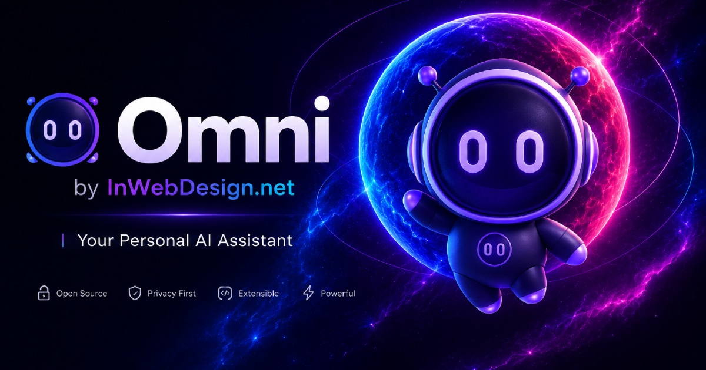

# 🚀 Omni – Hyper-Personalized Media Network & Feed Assembly Engine

[](LICENSE)
[](https://nextjs.org/)
[](https://strapi.io/)
<a href="https://inwebdesign.net" target="_blank" rel="noopener noreferrer"></a>
[](https://omni-socket.inwebdesign.net)
[](https://ollama.com)
[](https://www.postgresql.org/)
[](https://pm2.io/)

<p align="center">
  
</p>

**Omni** is a modern, high-performance open-core boilerplate for hyper-personalized social networks, encrypted video streaming platforms, real-time WebSocket chat networks, and AI-driven media distribution hubs. Built with **Next.js 16 (App Router)**, **Strapi v5 (PostgreSQL)**, **Standalone WebSocket Microservice (`omni-socket`)**, **Level 4 AES-128 HLS Video Transcoding**, and **Local Ollama AI Orchestration**, Omni introduces **Stateful Preference Vectors** to replace traditional, expensive event-logging databases.

---

## 🌐 Live Demo & Credentials

You can test the running production deployment online:

* 📱 **Live Web Application:** <a href="https://omni-web.inwebdesign.net/" target="_blank" rel="noopener noreferrer">https://omni-web.inwebdesign.net/</a>
* ⚙️ **Strapi CMS Admin Panel:** <a href="https://omni-cms.inwebdesign.net/admin" target="_blank" rel="noopener noreferrer">https://omni-cms.inwebdesign.net/admin</a>
* ⚡ **WebSocket Service:** <a href="https://omni-socket.inwebdesign.net" target="_blank" rel="noopener noreferrer">https://omni-socket.inwebdesign.net</a> (Port 4000)

### 🔑 Demo Login Credentials

#### 1. Frontend Test User Accounts (Web App)
You can log in directly via the Quick-Login presets in the login modal or use these credentials:
* **Demo Tech User (Tech & Science Focus):**
  * **E-Mail / Identifier:** `demotech@inwebdesign.net`
  * **Password:** `DemoUser2026!`
* **Demo Gourmet User (Cooking & Nature Focus):**
  * **E-Mail / Identifier:** `demogourmet@inwebdesign.net`
  * **Password:** `DemoUser2026!`

#### 2. Strapi CMS Admin Access (Demo Editor)
* **Admin URL:** <a href="https://omni-cms.inwebdesign.net/admin" target="_blank" rel="noopener noreferrer">https://omni-cms.inwebdesign.net/admin</a>
* **Identifier:** `demo-editor1@inwebdesign.net`
* **Password:** `DemoSecret2026!`

---

## 📄 License & Premium AI Features

The core boilerplate is open-source under the **[MIT License](LICENSE)**: feed assembly, the video library catalog, batch tracking, content detail views, the shorts feed, real-time messaging and notifications, subscriptions, favorites, authentication, the content-kind registry, the block editor, the upload pipeline and the encrypted HLS delivery path. You are free to use, modify, and distribute this foundation for your own projects.

### 🌟 Unlock the Premium AI Engine & Managed Hosting
The advanced local LLM orchestration (Ollama Llama 3.1 & Moondream Vision AI), real-time intent classification, conversational memory, and automated vector mutation are part of the **InWebDesign Premium AI Engine**.

The assistant streams: Ollama is called with `stream: true`, Strapi forwards the deltas as Server-Sent Events and the Next.js route pipes them straight through, so text appears as the model produces it rather than after it has finished. Because the algorithm-adjustment payload is structured JSON — and half-finished JSON cannot be shown to a reader — the vector update is a second, non-streamed call issued only when a message plausibly expresses a preference.

If you want to integrate the complete AI orchestration into your project without building it from scratch, we offer fully managed hosting, Proxmox LXC cluster deployments, and custom AI consulting.

📩 <a href="https://inwebdesign.net" target="_blank" rel="noopener noreferrer"><strong>Contact InWebDesign for Premium AI Integration & Managed Hosting</strong></a>

---

## 🧠 Key Features & Architectural Highlights

### 1. 🎯 Stateful Preference Vectors & Dynamic Vector Decay (Vision & Core Architecture)
Omni replaces traditional event-log database bloat with a lightweight, stateful **Preference Vector Engine** stored directly inside a single `affinityGraph` JSONB field per user in PostgreSQL:

```json
{
  "contentTypes": { "video": 0.8, "pdf": 0.85, "article": 0.7, "short": 0.5 },
  "topics": {
    "Science": { "score": 95, "last_interacted": "2026-08-14T10:00:00Z" },
    "PostgreSQL": { "score": 100, "last_interacted": "2026-08-14T10:00:00Z" }
  },
  "creators": { "1": { "score": 50, "last_interacted": "2026-08-14T10:00:00Z" } }
}
```

* 📉 **Time-Weighted Vector Decay:** Older topic scores automatically decay over time using a time-weighted decay function. Active user engagements boost scores, while inactive topics naturally fade.
* 🤖 **AI Dynamic Keyword Extraction:** As users consume media or talk to the AI Assistant ("Show me recipes", "Science PDFs"), the system dynamically parses intent, mutates `affinityGraph` vectors, and renders visual badges (`⚡ Algorithm Adjustment: Cooking +95%`).
* ⚡ **Strict 50-Keyword Performance Cap:** To guarantee sub-10ms feed assembly and prevent memory bloat, `affinityGraph` enforces a strict cap of **maximum 50 topics**. Low-ranking or decayed topics are automatically pruned.

### 2. ⚡ Standalone WebSocket Microservice (`omni-socket`) & Real-Time Chat Engine
Omni features a dedicated, low-latency WebSocket microservice (`socket/`) running on port 4000 behind Nginx SSL (`omni-socket.inwebdesign.net`):

* 🔌 **Zero-Polling Architecture:** Replaces expensive HTTP polling with instant, bi-directional WebSocket event delivery.
* 💬 **Dual-View Chat System:** Full-screen 2-column view and compact floating support widget. Supports 1:1 direct user DMs, global community channels, and group chat rooms.
* 🤖 **Dynamic AI Assistant Invitation (`[+ Invite AI]` / `[x Remove AI]`):** Users can dynamically invite the Omni AI Assistant into any chat room. When invited, the bot responds contextually; when removed, it leaves the room cleanly via real-time WebSocket signals.
* 🔒 **Granular Privacy & Subscriber-Only DMs:** Users can set direct message permissions (*Everyone*, *Subscribers Only*, *Nobody*). When set to *Subscribers Only*, the system verifies active channel subscriptions before allowing DMs.
* ✍️ **Typing Indicators:** Relayed over `chat:typing` and keyed by user id, with entries expiring locally after five seconds. A client that crashes or loses its connection never sends the closing event, so without an expiry the indicator would stay up forever.
* 🔕 **Per-Room Notification Rules:** Direct and global rooms notify by default and can be switched off; group rooms stay quiet until a participant subscribes; the AI room never notifies, because the assistant answers while you are looking at it. The fan-out decides by room type rather than by the presence of a subscription record — a missing record can then only cause one notification too many, never a message that is silently never announced.
* 📜 **Incremental History:** Rooms load the newest page first and fetch older messages as the reader scrolls up, correcting scroll position on prepend so the view does not jump. The room list reads a denormalised preview off each room instead of populating every message ever written to render one line each.

### 3. 🔔 In-App Notifications & Real-Time Drawer
Omni features a centralized notification engine (`api::notification.notification`):

* 📬 **Header Notification Drawer:** Real-time unread badges (`NotificationsBadge`) in the top navigation bar with quick mark-as-read and mark-all-read controls.
* 🚀 **Automated Notification Triggers:** Fires automated notifications for `new_subscriber`, `chat_invite`, and comment replies.
* 🔗 **Smart Deep-Linking:** Clicking a notification automatically opens the target chat room (`openChat(roomId)`), video player, or user profile without page reloads.
* 📄 **Paginated, Not Truncated:** the drawer requests an explicit page size and reports the total. Strapi's `defaultLimit` is 25, so a route that omits pagination silently returns the first 25 rows and presents them as the whole set — worth checking in any new list endpoint.

### 4. 🔔 Subscriptions & Standardized Favorites System
* 🔔 **Subscriptions Engine (`api::subscription.subscription`):** One model covers both channel subscriptions (creators, with live subscriber counting) and chat-room subscriptions. Each record carries an explicit `isSubscribed` flag rather than encoding the answer in whether a row exists, so "subscribed", "explicitly muted" and "never decided" stay distinguishable.
* ⚡ **Interactive `<SubscribeButton>` Component:** Features optimistic UI updates, state synchronization, and floating Toast notifications (*"Channel subscribed successfully! 🎉"*).
* ❤️ **Standardized Favorites (`api::favorite.favorite`):** Unified REST API (`/api/favorites`) allowing users to favorite and bookmark videos, articles, and feed items across the platform.

### 5. 🔒 Level 4 AES-128 Encrypted HLS Video Pipeline
Omni implements an enterprise-grade content security architecture:

* 🔐 **On-Disk AES-128 Encryption (Level 4 Security):** Every `.ts` video segment file stored on disk is encrypted with a unique 128-bit AES key (`enc.key`). Raw `.ts` files are 100% unplayable if copied directly.
* 🔑 **Visibility-Gated Key Authorization Endpoint (`/api/media/key/[slug]`):** The 16-byte AES decryption key is released according to the video's own `visibility` field, not according to whether a session exists. Published (`public`) videos stream for anonymous visitors, while `private` videos return `401`/`403` unless the requesting session owns them. The same check guards the unencrypted MP4 renditions; HLS segments need no gate of their own, since they are AES-encrypted on disk and useless without the key.
* 🛡️ **Client Memory Isolation:** Native `hls.js` decodes segments into tab-scoped `blob:http://...` MediaSource buffers, preventing direct URL hotlinking and unauthorized media extraction.

> ⚠️ **Deployment note — never symlink the media directory into `web/public/`.**
> Anything reachable under `web/public/` is served by Next.js as a static asset *before* App Router route handlers run. A `web/public/media -> /path/to/media` symlink therefore silently bypasses `app/media/[...path]/route.ts` entirely, taking the visibility check, the traversal guard and the Range implementation out of the request path. Point `MEDIA_ROOT` in the route handler at the media directory instead and let every `/media/*` request go through it.

### 6. 🎬 Custom YouTube-Style Video Player & Interactive Tag Engine
* 🎛️ **Player Controls (`web/src/components/CustomVideoPlayer.tsx`):** Scrub-bar hover timestamps, smooth play/pause animations, volume hover expansion, full-screen toggle, and a time display that switches between elapsed and remaining on click.
* ⚙️ **Nested Settings Menu:** The gear opens a panel that drills down the way a phone settings screen does — the root lists sections with their current value, picking one slides its panel in, a back header returns. Quality (`Auto`, `1080p`, `720p`, `480p`), ambient intensity, loop and vertical view all live there.
* 🌈 **Ambient Mode:** A 32×32 canvas samples the current frame five times a second, averages it, and paints a blurred radial glow behind the player. Dark theme only, adjustable from barely-there to full, and it stops sampling when the video pauses or the tab is hidden.
* 🔗 **One HLS Attachment Path (`useHlsSource`):** The detail player and the shorts feed share a single hook that attaches hls.js, reports the available levels, falls back to the MP4 rendition on a fatal manifest error, and — in the feed — attaches only to the item currently on screen, so scrolling a long feed never accumulates player instances.
* 🏷️ **Interactive Clickable Tag Engine:** All video tags on detail pages (`#Breakfast`, `#NextJS`) are interactive links navigating directly to `/videos?page=1&includetag=...`.

### 7. 🌐 Multilingual i18n — UI Dictionaries and Localized Content
* 🇩🇪 🇬🇧 **Central Dictionary Infrastructure (`web/src/dictionaries/de.json` & `en.json`):** Complete UI internationalization covering headers, search bars, player controls, user profiles, chat widgets, privacy modals, and AI assistant prompts.
* 🔄 **Instant Language Switching:** Instant toggle between German (`DE`) and English (`EN`) with persistent local storage and cookie sync.
* 🗂️ **Localized Content Types:** Articles, images and videos are Strapi i18n documents. The editor exposes both languages side by side, block structure stays in sync across them, and per-locale save failures come back as a `422` naming the language and the upstream message rather than a bare status.

> ⚠️ **Working with Strapi i18n: two rules that are easy to learn the hard way.**
>
> **1. "No locale" means the default locale, not "all".** Strapi resolves an unspecified `locale` to the default one (`en` here). Creating, saving and deleting each need it stated explicitly — a `DELETE` without `?locale=*` removes only the default language and reports success.
>
> **2. A localized relation target must exist in the referencing locale.** Pointing an article's image block at a document that has no entry in the locale being written fails the whole write:
>
> ```
> 400 ValidationError: Document with id "<id>", locale "en" not found
> ```
>
> Because block structure is mirrored across languages, one media item existing in only one language breaks the save for the entire document — including the language that was perfectly valid. Media is therefore created in *every* configured locale from the start: the file, URLs and dimensions are identical across languages anyway, and only title, summary and tags ever differ.

---

### 8. 🧩 Content-Kind Registry — One Table, Three Kinds
Video, article and image share almost everything: list pages, edit modals, ownership checks, visibility rules, REST shapes. Rather than writing that three times, a single table in `packages/shared` declares them and the rest derives from it:

```ts
export const CONTENT_KINDS = {
  video:   { uid: 'api::video.video',     plural: 'videos',   route: 'video',   listRoute: 'videos',   ownerField: 'creator', media: 'hls'  },
  article: { uid: 'api::article.article', plural: 'articles', route: 'article', listRoute: 'articles', ownerField: 'creator', media: 'none' },
  image:   { uid: 'api::image.image',     plural: 'images',   route: 'image',   listRoute: 'images',   ownerField: 'creator', media: 'webp' },
} as const;
```

* 🔁 **One Route, Every Kind:** `web/src/app/api/content/[kind]/[action]/route.ts` serves `list`, `mine`, `settings`, create, update and delete for all three. `mine` takes the owner from the session and never from the query string.
* ➕ **Adding a Fourth Kind:** an entry here plus its kind-specific renderer. Routes, hooks, list pages, edit modals and CMS controllers follow.
* 🚧 **Where This Deliberately Stops:** `feed-item` is a container with a different shape and is not in the table. Abstraction that has to be argued into place tends to be the wrong abstraction.

### 9. 📝 Content Blocks — A Dynamic-Zone Editor in the Frontend
Articles are composed from a Strapi dynamic zone (`headline`, `rich-text`, `image`, `video`, `quote`) edited entirely from the web app, without sending authors to the admin panel.

* 🎚️ **Reorder by Drag or Button:** `@dnd-kit` for pointer users, explicit up/down buttons for everyone else.
* 🖼️ **Media Blocks Pick From Your Own Library:** debounced search over the author's images and videos, or drop a file straight into the block — the upload is tracked by the global manager and the relation is set when it finishes.
* ▶️ **Video Blocks Play In Place:** the poster's play button mounts the shared player on click rather than eagerly, so an article with several video blocks does not keep one hls.js instance alive per block.

### 10. ⬆️ Upload Pipeline & Global Task Manager
* 📦 **Chunked Uploads With Handles:** `UploadContext` returns a task id per file so any caller — a modal, a content block — can follow that specific upload rather than guessing from a global list.
* 🔒 **Private By Default:** a file that has just finished uploading has been reviewed by nobody — no title check, no thumbnail chosen, for video not even a finished transcode. Uploads therefore land as `private` and publishing is one switch in the settings modal. Unpublishing something strangers have already seen is not.
* 🧲 **Docks That Respect Each Other:** the chat publishes its footprint as `--chat-dock-height` and the upload manager stacks above it, the same way `--footer-overlap` keeps floating elements off the footer.

### 11. 🎨 Design Tokens & Theme Switching
* 🌗 **Three-State Theme:** system, dark and light, resolved onto `data-theme` plus a `dark` class on the root element, persisted in `localStorage` and reacting to `prefers-color-scheme` changes without a reload.
* 🎛️ **Tokens, Not Hard-Coded Colours:** surfaces, text and borders come from CSS custom properties (`--bg-base`, `--surface`, `--surface-raised`), so a theme is a token set rather than a sweep through every component.

---

## 🛠️ Monorepo Structure

```
omni-stack-ai/
├── cms/                     # Strapi v5 Headless CMS (PostgreSQL, TypeScript Factories & Schemas)
│   ├── config/              # PostgreSQL, CORS & Plugin configurations
│   └── src/
│       ├── api/             # Controllers, Services (feed, subscriptions, favorites, notifications, chat)
│       ├── components/      # Dynamic-zone block schemas (headline, rich-text, image, video, quote)
│       └── index.ts         # Bootstrap: permissions, cron, default-deny visibility middleware
├── packages/
│   └── shared/              # @omni/shared — content-kind registry & affinity types used by web + cms
├── socket/                  # Standalone Real-Time WebSocket Server (omni-socket, Port 4000)
│   └── src/index.ts         # Socket.io gateway: chat, typing, notification fan-out (builds to dist/)
├── web/                     # Next.js 16 App Router Frontend
│   ├── src/app/             # Pages, Catalog (/videos), Detail View (/video/[slug]), Shorts (/shorts)
│   ├── src/app/api/         # BFF routes — the browser never talks to Strapi directly
│   ├── src/components/      # CustomVideoPlayer, ChatWidget, NotificationDrawer, GlobalUploadManager
│   │   └── article/blocks/  # Content-block editor (drag & drop, media pickers, inline upload)
│   ├── src/context/         # AppContext (i18n), ChatContext (rooms, socket), UploadContext (tasks)
│   ├── src/lib/hooks/       # useHlsSource, useContentEditForm, useUploadManager
│   └── src/dictionaries/    # Multilingual i18n JSON Dictionaries (de.json, en.json)
├── ecosystem.config.js      # PM2 Process Manager setup (omni-cms, omni-web, omni-socket)
├── turbo.json               # Turborepo task pipeline (Turbo v2)
├── package.json             # Monorepo workspaces configuration (cms, web, packages/*)
└── LICENSE                  # MIT License (InWebDesign)
```

*Note: The [media converter](docs/CONVERTER_SERVICE.md) runs in a separate LXC container by design, to keep heavy FFmpeg transcoding off the web/CMS container.*

---

## 🚀 Getting Started

### Prerequisites
* **Node.js:** `v20` or higher (`cms/package.json` declares `>=20.0.0 <=26.x.x`)
* **PostgreSQL:** `v15` or higher
* **FFmpeg:** `v6.0` or higher (with QSV / HLS support)
* **PM2:** `npm install -g pm2`

### 1. Installation
```bash
git clone git@github.com:InWebDesign-net/omni-stack-ai.git
cd omni-stack-ai
npm install
```

### 2. Database & Environment Setup
Create PostgreSQL database `omni_stack_db`, then configure all three services.

```env
# cms/.env
DATABASE_CLIENT=postgres
DATABASE_HOST=127.0.0.1
DATABASE_PORT=5432
DATABASE_NAME=omni_stack_db
DATABASE_USERNAME=omni_user
DATABASE_PASSWORD=omni_password_secure
OLLAMA_URL=http://10.0.0.6:11434/v1/chat/completions
OLLAMA_MODEL=llama3.1:latest
DEMO_MODE=false      # ON when unset: wipes demo content and every affinityGraph nightly at 04:00
```

```env
# web/.env.local
STRAPI_URL=http://127.0.0.1:1337
STRAPI_API_TOKEN=<full-access token created in the Strapi admin panel>
NEXT_PUBLIC_SOCKET_URL=http://127.0.0.1:4000
NEXT_PUBLIC_DEMO_USER_PASSWORD=      # empty hides the demo quick-login buttons
```

`STRAPI_API_TOKEN` stays server-side. The browser talks only to the Next.js routes under `web/src/app/api/`, which attach the token and, where ownership matters, the user id resolved from the session cookie. Nothing in the client bundle should ever hold it.

```env
# socket/.env
JWT_SECRET=<same value as cms/.env>
STRAPI_URL=http://127.0.0.1:1337
ALLOWED_ORIGINS=https://your-domain.example    # comma-separated
```

Set `ALLOWED_ORIGINS` in any deployment reachable from outside your own machine — it is the only thing restricting which origins may open a socket connection. Left unset, the gateway falls back to local development origins and says so on startup; `ALLOW_ANY_ORIGIN=true` restores the old wide-open behaviour for throwaway environments, and announces itself just as loudly.

Every variable is described in `cms/.env.example`, `web/.env.example` and `socket/.env.example`.

> ⚠️ **Demo credentials come from the environment, not from the code.**
> `DEMO_USER_PASSWORD` and `DEMO_EDITOR_PASSWORD` (in `cms/.env`) seed the demo accounts, and `NEXT_PUBLIC_DEMO_USER_PASSWORD` fills the quick-login buttons. The credentials this preview uses are published above on purpose — what does not belong in a boilerplate is the *pattern* of a password literal sitting in a seeding routine. Leave them unset in a real deployment: the demo accounts are then never created, rather than created with a password anyone can read in your repository.

### 3. Build & Run with PM2
```bash
# Build both apps via Turborepo
npm run build

# Start services under PM2 (omni-cms, omni-web, omni-socket)
npm run start
```

Services will be online:
* **Frontend (Next.js):** `http://localhost:3000` (or <a href="https://omni-web.inwebdesign.net/" target="_blank" rel="noopener noreferrer">https://omni-web.inwebdesign.net/</a>)
* **CMS Backend (Strapi):** `http://localhost:1337` (or <a href="https://omni-cms.inwebdesign.net/admin" target="_blank" rel="noopener noreferrer">https://omni-cms.inwebdesign.net/admin</a>)
* **WebSocket Service:** `http://localhost:4000` (or <a href="https://omni-socket.inwebdesign.net" target="_blank" rel="noopener noreferrer">https://omni-socket.inwebdesign.net</a>)

---

## 📚 Technical Documentation & Service Guides

Detailed architectural guides and setup instructions for external microservices and AI modules:

- 🎞️ **[Media Converter Service Guide](docs/CONVERTER_SERVICE.md)**: HLS Transcoding pipeline, FFmpeg specs, folder-in/out patterns vs. production button/queue integrations.
- 📝 **[Content Fill Service Guide](docs/CONTENT_FILL_SERVICE.md)**: Automated metadata generation pipeline, SQLite state DB, dev/demo auto-filling vs. production human-in-the-loop admin workflows. Currently a separate process; moving its logic into Strapi as a configurable surface is being worked out in [discussion #94](https://github.com/InWebDesign-net/omni-stack-ai/discussions/94).
- 🧠 **[Local AI Integration Guide](docs/AI_VISION_AND_LLM_SERVICES.md)**: Ollama setup, Moondream2 Computer Vision, Llama 3.1 bilingual JSON generation, and model swapping guidelines.
- 🔒 **[Omni Viewer Visibility Guide](docs/OMNI_VIEWER.md)**: Default-deny visibility middleware and user access policy architecture.

---

## 🌐 Managed Hosting & Consulting

For enterprise deployments, custom AI prompt engineering, or managed Proxmox LXC clustering:

* **Website:** <a href="https://inwebdesign.net" target="_blank" rel="noopener noreferrer">https://inwebdesign.net</a>
* **Copyright:** © 2026 InWebDesign. All rights reserved.
